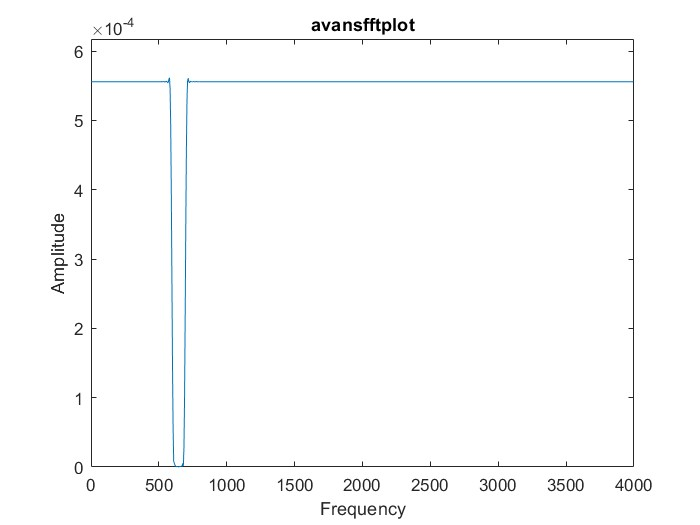

# Individueel Project PvA
**Jader Vulcano 2174242**

## Introductie

Voor het individueel project heb ik besloten om een digitale pedal effect board te ontwikkelen. Deze zal gebruik maken van OpenCL om de audio filters uit te rekenen. De filters zullen eerst worden ontwikkeld in MATLAB en daarna geoptimaliseerd met OpenCL. 

De applicatie zal gebruik maken van DearPyGui om een GUI te maken. De GUI zal de gebruiker in staat stellen om verschillende effecten toe te voegen aan de audio. De effecten zullen worden toegevoegd aan een effect chain. De effect chain zal de audio door de effecten heen sturen en de output van de effect chain zal worden afgespeeld. 

De applicatie zal in de vorm zijn van een node editor. Hierin zal elk effect beschikbaar zijn als een node. Ook zal er een visualisatie node beschikbaar zijn. Deze kan geplaatst worden op elk punt in de effect chain. 

De applicatie zal geschreven worden in python en gebruik maken van de volgende libraries:
- OpenCL
- DearPyGui
- PyAudio
- NumPy

Voor projectstructuur zal er gebruikt worden gemaakt van github issues.

Ook is het mogelijk dat er andere libraries worden gebruikt voor het berekenen van de audio filters. Deze zullen uit het onderzoek rollen.

## Planning

Eerst zal er een onderzoek worden gedaan naar de verschillende audio filters die mogelijk zijn. Hierbij zal er worden gekeken naar de verschillende effecten die mogelijk zijn en hoe deze kunnen worden geïmplementeerd. 

Daarna zal er een prototype worden gemaakt in MATLAB. Hierin zullen de effecten worden geïmplementeerd en getest. Deze zullen dan worden geoptimaliseerd met OpenCL.

## Logboek

| Datum | Onderwerp                                                     | Tijd (uren) |
| ----- | ------------------------------------------------------------- | ----------- |
| 08/05 | Onderzoek opencl                                              | 2           |
| 15/05 | Onderzoek dpg                                                 | 2           |
| 22/05 | Onderzoek numpy en opencl                                     | 2           |
| 27/05 | Onderzoek ruis                                                | 6           |
| 11/06 | gui verder uitwerken                                          | 5           |
| 17/06 | buffer probleem oplossen; distortion toegevoegd               | 7           |
| 18/06 | fourier transformatie toegevoegd, band pass filter toegevoegd | 10          |
|       |                                                               |             |

- [X] fix live input
- [X] fix noise when using filter
- [X] implement buffer system
- [X] implement convolutie kernel program
- [X] add stop recording button
- [X] test convolution kernel
- [X] fix memory leak in opencl when closing application
- [X] design filter in matlab en export coefficients
- [X] implement low pass fir filter
- [X] implement fourier transform kernel
- [X] implement frequency spectrum visualisation
- [ ] implement compression filter
- [ ] implement inverse fourier transform kernel
- [ ] implement modifiable band pass filter
- [ ] implement distortion filter
- [ ] add adding nodes

### 15/05

* meerdere problemen met het data formaat, deze zijn opgelost

### 22/05

Ik loop tegen een onverwacht noise probleem aan na het implementeren van een simpele gain filter. Dit is op commit `2a9331f`. De gain heeft een factor 1. Maar ik krijg toch een onverklaarbare ruis in de output file (`output_gain.wav`). Ik zie na het inlezen van de file dat er in het `audio_data` bestand `nan` waardes zitten. Dit is direct na het inlezen van het `.wav` bestand. Ik weet dat alle parameters (sample rate, channels, etc) goed zijn. Ik heb dit gecontroleerd door de `audio_data` weer te schrijven naar een nieuw `.wav` bestand. Dit bestand klinkt precies zoals het origineel.

Uiteindelijk was het probleem dat de wave file values zijn encoded als 16 bit integers. Met dat opgelost kan een basis ui in dpg gerealiseerd worden.

### 11/06

> commit `6d311f3`

Ik heb een visualisatie van opgevangen audio toegevoegd aan de audio input node. Ik wou een buffer systeem implementeren dat de audio in chunks verwerkt. Hiervoor heb ik gebruik gemaakt van callbacks op de audioread functie van pyaudio. Ook heb ik een audio processing module aangemaakt en alle audio verwrking functies hierin geplaatst. De buffer werkt nog niet zoals verwacht.

### 17/06 

> commit `22a2ca7` 

De buffer werkt. Ook is er een gain node aangemaakt, en een visualisatie node. Deze zijn voor nu hard gecoded. Verder is er een convolutie kernel geschreven. Deze neemt een input en een serie coefficienten en voert een convolutie uit. Dit is een lichtelijk aangepaste versie van de convolutie operatie omdat deze iets simpeler in de kernel te implementeren is. Maar het resultaat is hetzelfde. De berekening die ik gebruik is de volgende:

$$
  y[n] = \sum_{k=0}^{N-1} {x[n+k] \cdot h[k]}
$$

met $x$ de input, $h$ de coefficienten, $y$ de output en $N$ de lengte van de coefficienten.

### 18/06

Om de convolutie te testen heb ik 1 specifieke toon uit `chime.wav` gefiltert met de filter gedefineert in `export.csv`. Deze filter is ontwikkeld in matlab en blokkeert het bereik van 600 tot 700 Hz. De frequentiekarakteristiek staat in Fig 1. 

 

Het resultaat is te horen in `output_bandpass_test.wav`. Verder heb ik een low pass filter ontworpen die frequenties boven de 10kHz blokkeert. Hierna ben ik een fourier transformatie gaan implementeren. Hiervoor maak ik gebruik van de discrete fourier transform. Deze ziet er als volgt uit:

$$
  X[k] = \sum_{n=0}^{N-1} {x[n] \cdot e^{-j2\pi \frac{kn}{N}}}
$$

Omdat vermigvuldigen met een complex getal lastig is in OpenCL heb ik de volgende formule gebruikt:

$$
  X[k] = \sum_{n=0}^{N-1} {x[n] \cdot \cos(2\pi \frac{kn}{N}) - x[n] \cdot \sin(2\pi \frac{kn}{N})}
$$

Nu kan ik de amplitude voor elk frequentiecomponent zo berekenen:

$$
  | X[k] | = \sqrt{Re(X[k])^2 + Im(X[k])^2}
$$

Ik heb inspiratie genomen van [deze](https://ochafik.com/p_501) blog post. Ik heb aanpassingen gemaakt omdat ik alleen de absolute waarde wil weten. Ook weet ik dat het imaginaire component van mijn input altijd 0 zal zijn. Daarmee kan ik specifieker zijn met mijn algoritme. Helaas werkt dit nog niet helemaal. De output komt niet overeen met de matlab variant. Wel is de output dichtbij de matlab variant. Het zou kunnen dat dit komt door de grootte van de variabelen. De afwijking is klein genoeg om te verwaarlozen.

## Eindproduct

In de applicatie zal je:
  - een node editor hebben waar je:
    - nodes kan toevoegen
    - nodes kan verbinden
    - nodes kan verwijderen
  - een node hebben voor input van de audio
    - deze input is een live audio source op het systeem
  - er zullen meerdere effecten beschikbaar zijn:
    - delay
    - lowpass filter
    - highpass filter
    - bandpass filter
    - visualisatie
  - de effecten zullen worden geoptimaliseerd met OpenCL
  - de effecten zullen worden getest in MATLAB
  - de effecten zullen worden getest in de applicatie
   